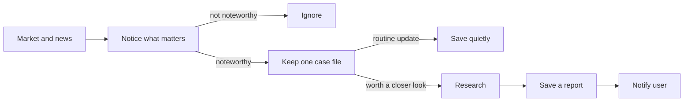

# AI Investment Assistant

A local market monitoring and research assistant. It watches a small list of US stocks, notices meaningful price moves or news, investigates selected situations, and sends a focused report to the user for review.

> It does not trade, promise certainty, or make investment decisions for you.

## How it works



Related updates stay on the same case so you are not flooded with repeats. Significant good news and bad news can both start a case. Details live in the [architecture](docs/ARCHITECTURE.md).

Current output is console-only. Market monitoring, news classification, and bounded
research are implemented. [Spec 010](specs/010-discord-and-operations/SPEC.md) defines
the next milestone: Discord delivery and operations. [Spec 011](specs/011-full-loop-hardening/SPEC.md)
defines the final replay and live-verification gate. Both are drafts with implementation
or execution still pending; see the [roadmap](docs/ROADMAP.md) for evidence and limits.

## Setup

Requires Python 3.14 and [`uv`](https://docs.astral.sh/uv/):

```bash
uv sync
cp .env.example .env
uv run ai-investment-assistant
```

Edit `.env` before a live run. Never commit `.env`.

| Variable                                                                                  | Needed for                                     | If blank                                                                         |
| ----------------------------------------------------------------------------------------- | ---------------------------------------------- | -------------------------------------------------------------------------------- |
| `INVESTMENT_ASSISTANT_ALPACA_API_KEY_ID` and `INVESTMENT_ASSISTANT_ALPACA_API_SECRET_KEY` | Live prices, the stock socket, and Alpaca news | Offline fixture demo                                                             |
| `INVESTMENT_ASSISTANT_OPENAI_API_KEY`                                                     | Live news classification and research          | Articles are saved; classification and new research are deferred. Saved reports can still be delivered. |
| `INVESTMENT_ASSISTANT_SEC_USER_AGENT`                                                     | Optional SEC contact string during research    | Filing lookups stay off. Local and web research still run.                       |
| `INVESTMENT_ASSISTANT_WATCHLIST`                                                          | Symbols to watch in live mode                  | Live start is rejected                                                           |

- Alpaca keys come from your Alpaca account. The default feed is `iex`.
- Create an OpenAI key at [platform.openai.com/api-keys](https://platform.openai.com/api-keys).
- For the SEC value, use a short contact string such as `Your Name you@example.com`.

## Checks

```bash
uv run ruff format --check .
uv run ruff check .
uv run mypy
uv run pytest
```

Further product, design, and project notes are in [`docs/`](docs/).

## License

MIT
