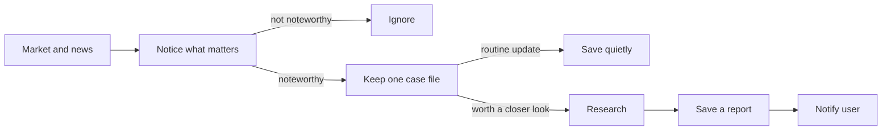

# AI Investment Assistant

A local market-monitoring and research assistant. It watches a small list of US stocks, notices meaningful price moves or news, investigates selected situations, and sends one focused report for review.

It does not trade, promise certainty, or make investment decisions for you.

## How it works



Related updates stay on the same case so you are not flooded with repeats. Significant good news and bad news can both start a case. Details live in the [architecture](docs/ARCHITECTURE.md).

## Setup

Requires Python 3.14 and [`uv`](https://docs.astral.sh/uv/):

```bash
uv sync
cp .env.example .env
uv run ai-investment-assistant
```

Edit `.env` before a live run. Never commit `.env`.

| Variable | Needed for | If blank |
| --- | --- | --- |
| `INVESTMENT_ASSISTANT_ALPACA_API_KEY_ID` and `INVESTMENT_ASSISTANT_ALPACA_API_SECRET_KEY` | Live market history, the stock socket, and Alpaca news retrieval | Offline fixture demo only |
| `INVESTMENT_ASSISTANT_OPENAI_API_KEY` | Live news classification (whether a stored article becomes a news signal) | News is still fetched and saved; every candidate is deferred and no news event is created |
| `INVESTMENT_ASSISTANT_WATCHLIST` | Which names to watch (required in live mode) | Live start is rejected |

Create an OpenAI key at [platform.openai.com/api-keys](https://platform.openai.com/api-keys) and paste it into `INVESTMENT_ASSISTANT_OPENAI_API_KEY`. Do that before a live news check; without it the app will not classify articles.

Alpaca keys come from your Alpaca account. Default feed is IEX.

Default logs are quiet JSON at `INFO`. Two optional switches do not change that default:

```bash
# Still JSON INFO, plus a periodic “still watching” line (useful on weekends)
INVESTMENT_ASSISTANT_HEARTBEAT=true

# Separate human-readable story of the run (backfill, socket, minutes, daily, events)
INVESTMENT_ASSISTANT_WATCH_LOG=true

# Easier-to-read standard logs (does not turn heartbeat or watch log on)
INVESTMENT_ASSISTANT_LOG_JSON=false
```

## Checks

```bash
uv run ruff format --check .
uv run ruff check .
uv run mypy src
uv run pytest
```

Further product, design, and project notes are in [`docs/`](docs/).

## License

MIT
