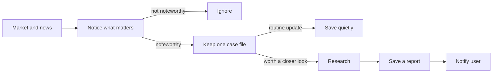

# AI Investment Assistant

A local market monitoring and research assistant. It watches a small list of US stocks, notices meaningful price moves or news, investigates selected situations, and sends a focused report to the user for review.

> It does not trade, promise certainty, or make investment decisions for you.

## How it works



Related updates stay on the same case so you are not flooded with repeats. Significant good news and bad news can both start a case. Details live in the [architecture](docs/ARCHITECTURE.md).

Market monitoring, news classification, bounded research, and Milestone 7 operations
are implemented. Live mode can deliver a saved report to one Discord
webhook with durable claims, receipts, finite retries, local recovery commands,
and a shared estimated model-cost ledger. [Spec 011](specs/011-full-loop-hardening/SPEC.md)
owns the remaining full-loop replay and live verification; see the
[roadmap](docs/ROADMAP.md).

## Setup

Requires Python 3.14 and [`uv`](https://docs.astral.sh/uv/):

```bash
uv sync
cp .env.example .env
uv run ai-investment-assistant
```

Edit `.env` before a live run. Never commit `.env`.

| Variable                                                                                  | Needed for                                     | If blank                                                                         |
| ----------------------------------------------------------------------------------------- | ---------------------------------------------- | -------------------------------------------------------------------------------- |
| `INVESTMENT_ASSISTANT_ALPACA_API_KEY_ID` and `INVESTMENT_ASSISTANT_ALPACA_API_SECRET_KEY` | Live prices, the stock socket, and Alpaca news | Offline fixture demo                                                             |
| `INVESTMENT_ASSISTANT_OPENAI_API_KEY`                                                     | Live news classification and research          | Articles are saved; classification and new research are deferred. Saved reports can still be delivered. |
| `INVESTMENT_ASSISTANT_DISCORD_WEBHOOK_URL`                                                | Live Discord alerts for saved reports          | Reports use console delivery. |
| `INVESTMENT_ASSISTANT_SEC_USER_AGENT`                                                     | Optional SEC contact string during research    | Filing lookups stay off. Local and web research still run.                       |
| `INVESTMENT_ASSISTANT_WATCHLIST`                                                          | Symbols to watch in live mode                  | Live start is rejected                                                           |
| `INVESTMENT_ASSISTANT_RESEARCH_STARTS_PER_DAY` | New research starts per UTC day (default 20, max 20) | Set to `0` to defer new research. |
| `INVESTMENT_ASSISTANT_CLASSIFIER_CALLS_PER_DAY` / `INVESTMENT_ASSISTANT_CLASSIFIER_CALLS_PER_PASS` | News classifier limits (defaults 100 / 20; maxima 100 / 20) | Set either to `0` to defer classification. |
| `INVESTMENT_ASSISTANT_DAILY_MODEL_BUDGET_USD` | Shared estimated OpenAI budget per UTC day (default $2.00, max $10.00) | Set to `0` to defer new model calls. Saved reports still deliver. |

- Alpaca keys come from your Alpaca account. The default feed is `iex`.
- Create an OpenAI key at [platform.openai.com/api-keys](https://platform.openai.com/api-keys).
- Create an incoming webhook in the intended Discord channel and keep its URL only
  in local `.env`. A bot token is not needed. A changed webhook does not replay
  completed reports. An uncertain send waits 15 minutes for one automatic resend;
  it may duplicate the first alert. If that resend cannot finish, the delivery is
  held. Keep the original webhook available for receipt confirmation.
- For the SEC value, use a short contact string such as `Your Name you@example.com`.

One live Discord smoke test passed on 25 September 2026 using a saved fake report
and an isolated database: Discord returned a message receipt, read-only lookup
verified it, and a restart made no second submission. The message is labeled
`FAKE RESEARCH — NOT INVESTMENT ANALYSIS`. Automated tests still use fake
providers; full-loop live checks belong to Milestone 8.
Use `uv run python -m investment_assistant notifications list` to inspect held or
failed delivery IDs. With the live loop stopped, use
`uv run python -m investment_assistant notifications confirm --delivery-id ID --message-id ID`
after finding the message in Discord, or
`uv run python -m investment_assistant notifications retry --delivery-id ID --accept-duplicate-risk`
to authorize one extra send on the next live pass. Retry can duplicate an alert;
confirmation only reads the message. Provider waits still apply. An automatic
uncertain resend must finish or be confirmed before a manual retry can be authorized.
The `uncertain_recovery` field in `notifications list` distinguishes an unused
resend allowance, a webhook that must be restored, and operator review after
the allowance was consumed.

The SQLite v7 upgrade preserves prior reports and notification history. A v5 or v6
database with earlier model calls on the upgrade's UTC day has unknown spend, so
new model calls wait until the next UTC day; saved reports can still deliver.
The $2 default reserves up to $1.62 for a new research run and $0.0825 for a
classifier call before I/O, then releases unused allowance when recorded usage is
valid. Failed or interrupted requests retain conservative charges. These are
application estimates, not an invoice or an account-wide spending limit.

In live mode, each pass attempts at most one due Discord submission before at
most one research run. A newly saved report waits for the next pass. After a
send or research call, the app fills any missed regular-session minutes, including
when the send fails or times out. Waiting or held alerts remain in SQLite and do
not prevent newer research. A changed webhook never resends completed updates;
removing it holds uncertain Discord work for recovery with the original webhook.
Console delivery is the explicit fallback only when no webhook is configured.

Default JSON logs record state changes without report text or credentials. Set
`INVESTMENT_ASSISTANT_HEARTBEAT=true` for a minute-by-minute status line: it shows
the notification destination, pending/uncertain/failed counts, oldest pending
age, estimated charged/reserved/remaining USD, and separate research/classifier
admission reasons with their required reservations. `MODEL_BUDGET` can therefore
block a $1.62 research run while a $0.0825 classification still fits. Set
`INVESTMENT_ASSISTANT_WATCH_LOG=true` independently for a more detailed local
process narrative. Uncertain counts include alerts waiting for the one automatic
resend; `uncertain_awaiting_resend` separates those from alerts needing operator
review. Historical superseded reports do not count as pending.

## Checks

```bash
uv run ruff format --check .
uv run ruff check .
uv run mypy
uv run pytest
```

Further product, design, and project notes are in [`docs/`](docs/).

## License

MIT
