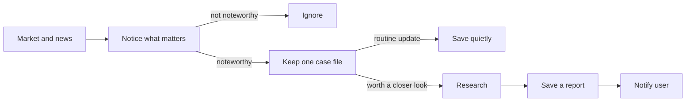

# AI Investment Assistant

A local market-monitoring and research assistant. It watches a small list of US stocks, notices meaningful price moves or news, investigates selected situations, and sends one focused report for review.

It does not trade, promise certainty, or make investment decisions for you.

## How it works



Related updates stay on the same case so you are not flooded with repeats. Significant good news and bad news can both start a case. Details live in the [architecture](docs/ARCHITECTURE.md).

## Setup

Requires Python 3.14 and [`uv`](https://docs.astral.sh/uv/):

```bash
uv sync
uv run ai-investment-assistant
```

Copy `.env.example` to `.env` and fill in Alpaca keys only if you want the live watch. Missing keys keep the offline fixture demo.

Default logs are quiet JSON at `INFO`. Two optional switches do not change that default:

```bash
# Still JSON INFO, plus a periodic “still watching” line (useful on weekends)
INVESTMENT_ASSISTANT_HEARTBEAT=true

# Separate human-readable story of the run (backfill, socket, minutes, daily, events)
INVESTMENT_ASSISTANT_WATCH_LOG=true

# Easier-to-read standard logs (does not turn heartbeat or watch log on)
INVESTMENT_ASSISTANT_LOG_JSON=false
```

## Checks

```bash
uv run ruff format --check .
uv run ruff check .
uv run mypy src
uv run pytest
```

Further product, design, and project notes are in [`docs/`](docs/).

## License

MIT
