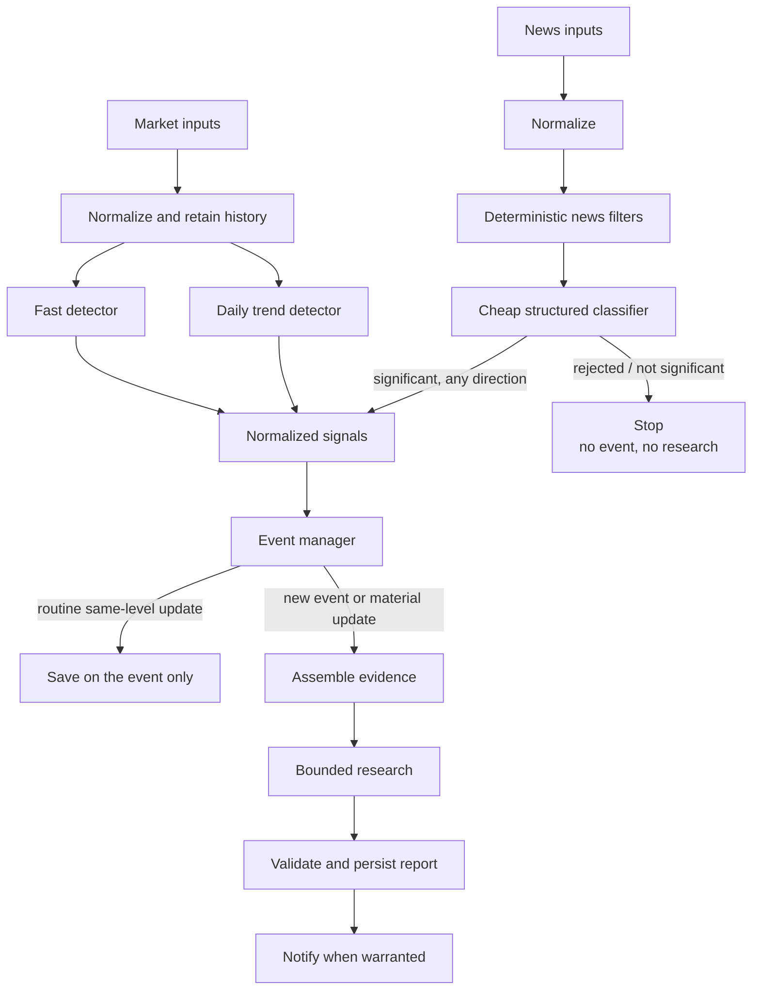
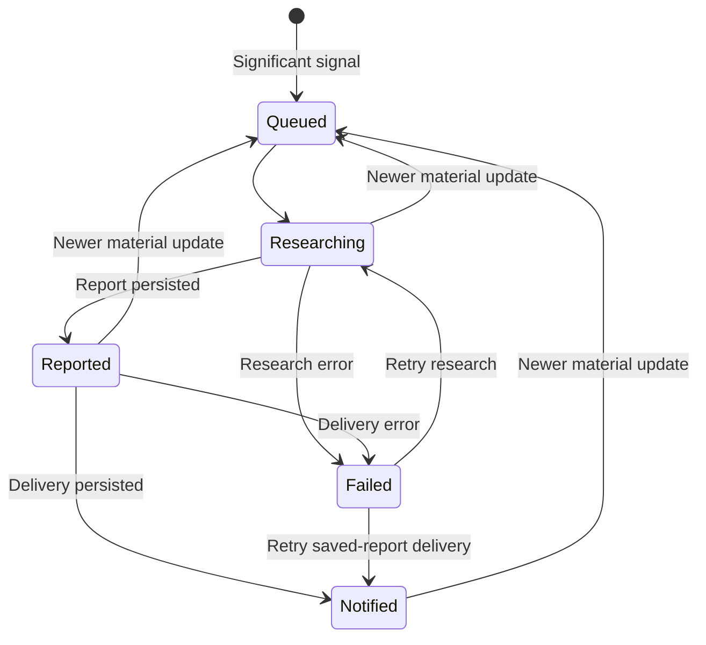

# AI Investment Assistant — Architecture

**Status:** Approved

The MVP is one local, single-process Python application. It may use `asyncio` for concurrent I/O but has no microservices or distributed workers.

Input never jumps to focused research. It must become a **signal**, then an **event that needs work**, then a **saved report**, then a **notification**.

Who decides what:

| Stage | Decides | Does not decide |
| --- | --- | --- |
| Market detectors | Whether price history is a market signal | Events, research, notification |
| News filters + cheap classifier | Whether an article is a news signal | Events, research, notification |
| Event manager | New vs existing event; whether the event needs work | Article wording or report content |
| Focused research | What happened and how certain that is | Whether the case should exist |

Product behavior is defined in [`PRODUCT.md`](PRODUCT.md), durable choices in [`DECISIONS.md`](DECISIONS.md), and implementation details in feature specs.

## Principles

- Deterministic code handles measurable rules, filtering, cooldowns, and deduplication.
- Market and significant news signals may qualify independently.
- Detectors emit signals; one event manager owns promotion and research eligibility.
- News classification is cheaper, news-path only, and separate from focused research.
- Significant news may be positive or negative; the classifier’s direction field does not by itself reject an article.
- Provider objects are normalized before entering core logic.
- Research receives application-assembled evidence and narrow read-only tools.
- Related signals enrich one durable event instead of creating repeated work.
- Add abstractions only at demonstrated replacement seams.

## Boundaries

### Input adapters

Adapters retrieve market and news data and convert provider responses into validated internal records. Alpaca is the first live provider, but its SDK types must not enter core logic. Replay fixtures use the same downstream boundaries.

### Detection

Detection consumes normalized records and only produces signals; it does not enqueue research.

- The fast market detector evaluates completed bars for abrupt movement and emits only on a qualifying threshold crossing or material severity escalation; same-severity continuation stays quiet until rearm.
- The after-close daily market detector uses the same history to evaluate five- and twenty-trading-day movement, recent-high drawdown, and performance relative to `SPY`.
- Storage-backed detector reads are bounded to the rule lookback and evaluated as of the triggering bar. Older recovered bars cannot rewind newer detector state; delayed same-session `SPY` data can complete a relative rule that was skipped earlier.
- News passes deterministic filters before a small structured classifier. The classifier may emit a significant news signal without a market signal. Significance is independent of direction: good news (for example an earnings beat or acquisition) and bad news can both qualify. Rejected articles never become signals. The current offline fixtures use a temporary negative-phrase rule until Milestone 5.

There is no separate weekly pipeline. Exact thresholds, severity boundaries, and rearm rules are feature-level decisions (Milestone 3 owns the first offline market set). Detector baseline state is durable for replay. Detection failures remain visible without crashing the application.

### Events

The event manager consumes all qualifying signals and alone owns correlation, promotion, deduplication, cooldowns, lifecycle state, retry eligibility, and research eligibility. A market or significant news signal may create an event by itself; later related signals enrich it. A new event or a material update **needs work** (research, then notify). An exact repeat is ignored. A same- or lower-importance update without a new horizon or new significant news is saved and does not requeue research.

Sustained directional movement is one evolving **open** episode. Same-severity repeats are retained without repeated work. A worse severity, a newly crossed horizon, or significant new news may update and requeue the episode. When market detector stress for that ticker and direction has fully rearmed/cleared, the episode closes so a later unrelated breach starts a new event rather than reopening finished history. Rejected inputs create no event or cooldown; notification cooldown begins only after successful delivery.

### Research

Research receives a prepared evidence packet only after an event needs work. The application may expose bounded read-only access to market and news providers, SEC EDGAR, prior history, and hosted web search. The model receives no credentials or unrestricted database, filesystem, shell, or network access. Its output must match a validated schema.

### Persistence

SQLite stores the state needed for recovery, history, replay, and idempotency:

- Configuration and watchlist data.
- Normalized market history and detector baselines.
- Signals, articles, and classifications.
- Event lifecycle and retry state.
- Reports, source metadata, and provenance.
- Notification attempts and failures.

Writes pass through one controlled application boundary.
For market ingestion, one completed-bar transaction owns the bar write, detector
state, signal/event acceptance, and episode maintenance so a partial failure cannot
suppress a signal that was never durably accepted.

### Output

Validate and persist a report before delivery. Discord is the first live notification adapter. Retries are allowed, but the same report must not be sent twice.

## Core data

Exact fields and type names belong to feature specs, but these concepts are stable:

| Concept | Responsibility |
| --- | --- |
| Market bar | One completed OHLCV period: ticker, timeframe, prices, volume, completeness, and provenance |
| Market signal | Rule, horizon, direction, baseline, observed movement, severity, time, and provenance |
| News article | Normalized identity, content metadata, symbols, source, and timestamps |
| News classification | Relevance, category, direction (positive, negative, or unclear), significance, confidence, and model metadata |
| News signal | A significant classified article, of any direction, eligible to create or enrich an event |
| Event | Independent or correlated signals, episode identity, severity, lifecycle, and deduplication state |
| Research input | Evidence packet and focused questions |
| Research report | Findings, evidence, competing explanations, uncertainty, confidence, and posture |

Retain provider, feed, source, retrieval time, and model or prompt version wherever they affect interpretation or replay.

## Event lifecycle

Lifecycle state survives restarts. Interrupted research resumes research, while a saved report or retryable delivery failure resumes notification without repeating research. Routine same-severity updates do not reopen completed work; escalation, a new horizon, or significant news requeues the event immediately.

## Reliability and security

- Keep one live stock stream during regular hours; detect stale sockets, reconnect, and backfill missing bars where possible.
- Persist event and notification state before irreversible actions.
- Use stable identifiers and idempotent processing.
- Retry transient failures with bounded backoff.
- Record invalid model output and unavailable research or delivery.
- Enforce classifier, research, tool, source-size, time, rate, and cost limits.
- Expose structured logs and basic health information. Default logs are quiet JSON at `INFO`. Heartbeat and the watch log are independent opt-ins (D-025); they do not change detection or event rules.
- Load credentials from the environment; never place them in fixtures, logs, or prompts.
- Validate external input and model output at their boundaries.
- Provide no brokerage or order-execution capability.

## First slices

- [Offline walking skeleton](../specs/001-offline-walking-skeleton/SPEC.md) proved fixtures → detection → event → fake research → console notify without live services.
- [Durable event foundation](../specs/002-durable-event-foundation/SPEC.md) added SQLite lifecycle state and independent market/news promotion through one event manager.
- [Market history and offline detection](../specs/003-market-history-and-offline-detection/SPEC.md) added persisted bars, fast/daily deterministic market rules, detector rearm state, and open/closed market episodes.
- [Live market data](../specs/004-live-market-data/SPEC.md) feeds those same bars from Alpaca REST history, after-close daily bars, and one stock websocket so completed regular-session minutes reach the fast detector in near real time.
- [Ops visibility](../specs/005-ops-visibility/SPEC.md) adds an optional live heartbeat and a separate optional watch logger. It does not change market rules or replace Milestone 5.

That path does not make news a gate for market events or market movement a gate for significant news. Later milestones add live market data, news classification that can accept significant good or bad news, real research, and Discord in roadmap order. Offline news detection today is a negative-phrase demo only.
