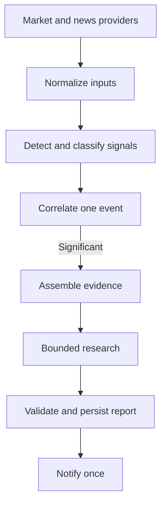
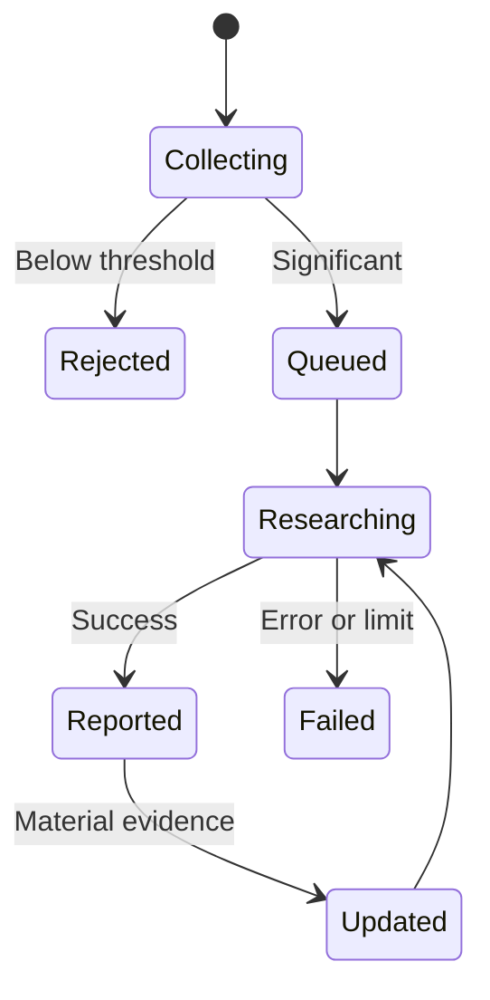

# AI Investment Assistant — Architecture

**Status:** Approved high-level architecture  
**Last reviewed:** July 31, 2026

## Document Purpose

This document defines the system's stable structure, boundaries, data flow, and reliability model.

Product scope belongs in [`PRODUCT.md`](PRODUCT.md). Development order belongs in [`ROADMAP.md`](ROADMAP.md). Exact behavior and implementation tasks belong under `specs/`.

## System Overview

The MVP is one local, single-process Python application. It monitors market and news data, identifies significant events, performs bounded research, saves the result, and sends one Discord notification.



The application uses `asyncio` where concurrent I/O is useful. It is not divided into microservices or distributed workers.

## Architectural Principles

- **Deterministic logic before AI:** normal code handles measurable rules, filtering, cooldowns, and duplicate detection.
- **Selective AI use:** a cheap news classifier is separate from the more capable research process.
- **Provider independence:** provider SDK objects are converted into internal models before entering core logic.
- **Application-controlled retrieval:** the application gathers evidence and exposes narrow tools; the model does not receive unrestricted access.
- **One event, one report:** related signals enrich a durable event instead of creating repeated research jobs and alerts.
- **Reliability before sophistication:** recovery, replay, deduplication, and cost controls take priority over additional indicators.
- **Thin vertical slices:** abstractions are added at real replacement seams, not through speculative scaffolding.

## Major Boundaries

### Provider Layer

Provider adapters connect to external services and normalize their responses.

Core interfaces include:

- `MarketDataProvider` for live and historical market data.
- `NewsProvider` for company-related news.
- A research boundary for producing a structured report.
- A notification boundary for delivering completed reports.

The initial live market and news provider is Alpaca. Core detection and research logic must not depend on Alpaca SDK types.

### Detection Layer

The detection layer consumes normalized inputs and produces scored signals.

- Market detection uses explicit price, relative-market, volume, and optional volatility rules.
- News processing applies deterministic filters before calling a small structured classifier.
- Failures are recorded and handled safely rather than stopping the pipeline.

### Event Layer

The event layer combines related market and news signals into an `EventCandidate`. It owns:

- Correlation by ticker, topic, category, and time window.
- Significance decisions.
- Deduplication and cooldowns.
- Lifecycle state and retry eligibility.
- Deciding whether new evidence justifies new research.

Market and news signals may arrive in either order. Only one active event should exist for the same ticker and topic.

### Research Layer

The research layer receives a prepared evidence packet only after an event passes the significance threshold.

It may retrieve additional evidence through bounded, read-only tools backed by:

- Market and news providers.
- SEC EDGAR.
- Prior application history.
- OpenAI hosted web search.

The model receives neither credentials nor unrestricted database, filesystem, shell, or network access. Its output must match a validated structured schema.

### Persistence Layer

SQLite stores the durable state needed for history, recovery, deduplication, and replay, including:

- Configuration and watchlist data.
- Signals, articles, and classifications.
- Event lifecycle state.
- Reports and source metadata.
- Notification attempts and failures.
- Provider and feed provenance.

Concurrent workers should write through one controlled database boundary or queue rather than independently coordinating SQLite writes.

### Output Layer

The output layer validates and persists a completed research report before attempting delivery.

Discord is the initial live notification adapter. Delivery must be idempotent: retries may occur, but the same completed report must not be sent twice.

## Core Data Contracts

Exact fields may evolve, but these concepts should remain stable:

| Contract | Responsibility |
|---|---|
| `MarketBar` | Normalized price and volume data with provider, feed, time, and completeness metadata |
| `MarketSignal` | A detected market condition, its baseline, score, and provenance |
| `NewsArticle` | Normalized article identity, content metadata, tickers, source, and timestamps |
| `NewsClassification` | Structured relevance, category, direction, significance, confidence, and model metadata |
| `EventCandidate` | Correlated signals, stable identity, significance, lifecycle, and deduplication state |
| `ResearchEvent` | Evidence packet and focused questions supplied to research |
| `ResearchReport` | Validated findings, evidence, competing explanations, uncertainty, confidence, and posture |

Provider, feed, source, retrieval time, and model or prompt version should be retained wherever they affect interpretation or reproducibility.

## Event Lifecycle



Lifecycle state must survive process restarts. A routine price update does not justify reopening a reported event; materially new evidence may.

## Reliability Model

The application must make failures visible and recover safely.

- Detect stale or disconnected streams.
- Reconnect automatically and backfill missing minute bars where possible.
- Persist event and notification state before irreversible actions.
- Use stable identifiers and idempotent processing to prevent duplicate work.
- Retry rate limits and transient failures with bounded backoff.
- Record invalid model output, unavailable research, and delivery failures explicitly.
- Enforce limits on classifier calls, research runs, tool calls, source size, time, and daily cost.
- Expose structured logs and basic health information.

Replay fixtures must pass through the same core detection, event, research, and notification boundaries used by live operation.

## Security Boundaries

- Credentials come from environment-based configuration and never enter the repository, fixtures, logs, or model prompts.
- External inputs and model outputs are validated before use.
- Research tools are narrow, read-only, and application-controlled.
- The system has no brokerage connection or order-execution capability.
- Notification payloads contain only the information required for the alert.

## First Implementation Slice

The offline walking skeleton proves the real internal flow before external integrations are introduced:

```text
JSON fixtures
  → normalization
  → deterministic detection
  → signal correlation
  → event
  → fake structured research report
  → console notification
```

It uses fake providers and no internet, secrets, database, LLM, Alpaca, SEC, or Discord access. Later milestones replace those adapters while preserving the core flow.

## Stable and Flexible Decisions

Stable architecture:

- One modular local Python application for the MVP.
- Provider-neutral internal models and narrow service interfaces.
- Deterministic detection before AI escalation.
- Separate news classification and research responsibilities.
- Durable correlated events, structured outputs, and idempotent notification.
- SQLite persistence, replay fixtures, and bounded read-only research tools.

Intentionally flexible:

- Exact package and class structure.
- Database schema and repository method names.
- Worker count and queue arrangement.
- Thresholds, correlation windows, and scoring formulas.
- Model choices, prompts, and report wording.
- Optional libraries not required by the active feature.

Changes to stable architecture require an entry in [`DECISIONS.md`](DECISIONS.md). Flexible details should be decided within the relevant feature spec when implementation evidence exists.
