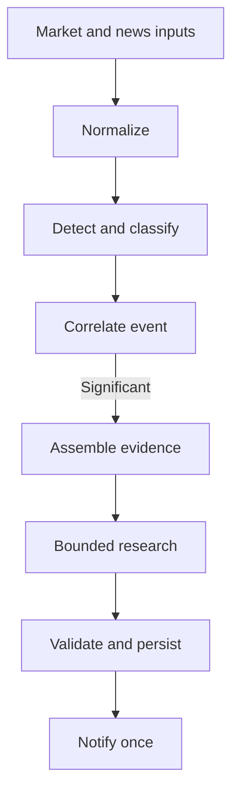
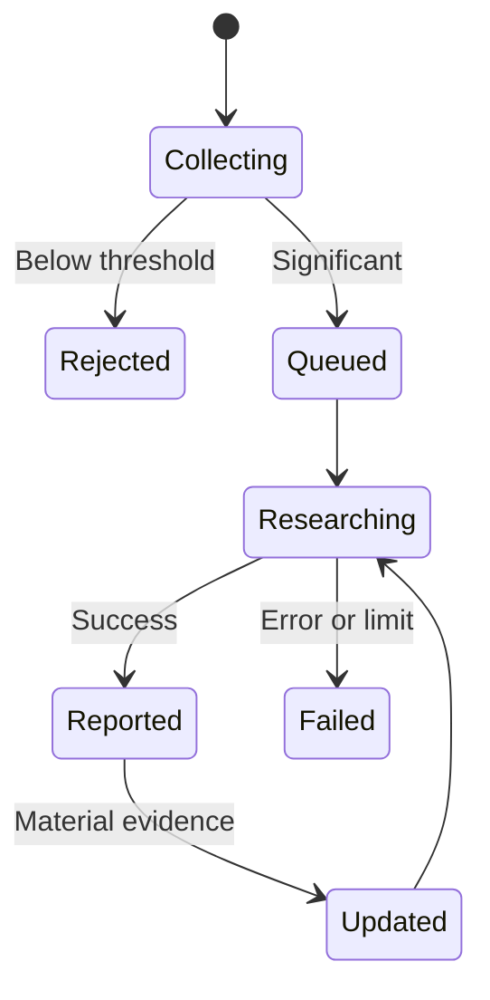

# AI Investment Assistant — Architecture

**Status:** Approved

The MVP is one local, single-process Python application. It may use `asyncio` for concurrent I/O but has no microservices or distributed workers.

Product behavior is defined in [`PRODUCT.md`](PRODUCT.md), durable choices in [`DECISIONS.md`](DECISIONS.md), and implementation details in feature specs.

## Principles

- Deterministic code handles measurable rules, filtering, cooldowns, and deduplication.
- News classification is cheaper and separate from focused research.
- Provider objects are normalized before entering core logic.
- Research receives application-assembled evidence and narrow read-only tools.
- Related signals enrich one durable event instead of creating repeated work.
- Add abstractions only at demonstrated replacement seams.

## Boundaries

### Input adapters

Adapters retrieve market and news data and convert provider responses into validated internal records. Alpaca is the first live provider, but its SDK types must not enter core logic. Replay fixtures use the same downstream boundaries.

### Detection

Detection consumes normalized records and produces signals. Market rules use explicit price, relative-market, volume, and optional volatility inputs. News passes deterministic filters before a small structured classifier. Failures remain visible without crashing the pipeline.

### Events

The event boundary owns correlation, significance, deduplication, cooldowns, lifecycle state, retry eligibility, and the decision to research materially new evidence. Market and news may arrive in either order; only one active event should represent the same ticker and topic.

### Research

Research receives a prepared evidence packet only after an event qualifies. The application may expose bounded read-only access to market and news providers, SEC EDGAR, prior history, and hosted web search. The model receives no credentials or unrestricted database, filesystem, shell, or network access. Its output must match a validated schema.

### Persistence

SQLite stores the state needed for recovery, history, replay, and idempotency:

- Configuration and watchlist data.
- Signals, articles, and classifications.
- Event lifecycle and retry state.
- Reports, source metadata, and provenance.
- Notification attempts and failures.

Writes pass through one controlled application boundary.

### Output

Validate and persist a report before delivery. Discord is the first live notification adapter. Retries are allowed, but the same report must not be sent twice.

## Core data

Exact fields and type names belong to feature specs, but these concepts are stable:

| Concept | Responsibility |
| --- | --- |
| Market record | Normalized price, volume, provider, feed, time, and completeness data |
| Market signal | Detected condition, baseline, score, and provenance |
| News article | Normalized identity, content metadata, symbols, source, and timestamps |
| News classification | Relevance, category, direction, significance, confidence, and model metadata |
| Event | Correlated signals, stable identity, significance, lifecycle, and deduplication state |
| Research input | Evidence packet and focused questions |
| Research report | Findings, evidence, competing explanations, uncertainty, confidence, and posture |

Retain provider, feed, source, retrieval time, and model or prompt version wherever they affect interpretation or replay.

## Event lifecycle

Lifecycle state survives restarts. Routine updates do not reopen a reported event; materially new evidence may.

## Reliability and security

- Detect stale streams, reconnect, and backfill missing bars where possible.
- Persist event and notification state before irreversible actions.
- Use stable identifiers and idempotent processing.
- Retry transient failures with bounded backoff.
- Record invalid model output and unavailable research or delivery.
- Enforce classifier, research, tool, source-size, time, rate, and cost limits.
- Expose structured logs and basic health information.
- Load credentials from the environment; never place them in fixtures, logs, or prompts.
- Validate external input and model output at their boundaries.
- Provide no brokerage or order-execution capability.

## First slice

The approved [offline walking skeleton](../specs/001-offline-walking-skeleton/SPEC.md) proves these boundaries with fixtures, fake research, and console output before any live integration or database is added.
