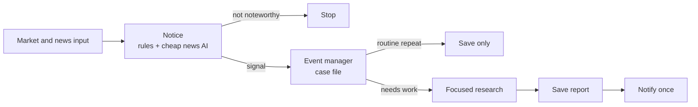

# AI Investment Assistant — Product

**Status:** Approved MVP

AI Investment Assistant is a local market-monitoring and research tool for one investor. It watches a small list of US stocks, detects meaningful market or news events, investigates selected events, and sends one focused Discord report for review.

It does not trade, promise certainty, or make final investment decisions. The user remains responsible for every decision.

System boundaries are defined in [`ARCHITECTURE.md`](ARCHITECTURE.md); milestone order is in [`ROADMAP.md`](ROADMAP.md); feature behavior belongs under [`specs/`](../specs/).

## Intended user

The MVP is a **local tool for one person** and a **small US watchlist**. Those are product limits, not a claim that every user has the same strategy.

Users may mix reasons for watching a name. One example is a multi-year thesis (“I want to own AMD for the next several years”) and still acting on meaningful dips, spikes, or news. Other examples include watching a name they do not own yet, comparing a few candidates, or holding some names longer than others. A lasting thesis is **one** valid use, not the required identity.

The assistant notices meaningful situations and prepares a report. The user decides whether to buy, sell, hold, or wait. Day trading, scalping, high-frequency strategies, and autonomous execution are out of scope. See [D-023](DECISIONS.md).

## Core loop and principles

> Input → notice (signal) → case file (event) → research only if the event needs work → save report → notify when warranted.

A **signal** is a structured notice that something noteworthy happened. An **event** is the saved case file that groups related signals for one situation. Not every signal starts research; see [when an event needs work](#when-an-event-needs-work).

- Use ordinary code for measurable rules, filtering, correlation, cooldowns, and deduplication.
- Allow market and significant news signals to qualify independently; neither is required to validate the other.
- Let detectors emit signals while one event manager owns promotion and research eligibility.
- Use AI only for narrow news classification and focused research after an event needs work.
- Keep classification inexpensive and on the **news path only**; it does not judge market-rule signals or replace the event manager.
- Significant news may be positive or negative; direction does not by itself reject an article.
- Distinguish evidence from inference, cite important sources, and state uncertainty.
- Prefer recovery, replay, duplicate prevention, and cost control over more indicators or agents.
- Support review; never issue authoritative buy or sell instructions.

## MVP scope

### Configuration

The user can configure:

- A small watchlist and whether each stock is owned or watched.
- Optional cost basis and personal notes.
- Detection thresholds, correlation windows, cooldowns, and market-hours behavior.
- Notification preferences and API rate and cost limits.

The application has no brokerage connection.

### Market monitoring

Maintain normalized market history for the watchlist and a few comparison symbols. Use three deterministic evaluations in one pipeline:

- A fast detector evaluates completed minute bars for abrupt movement over about one hour.
- A session-open check compares the prior regular close to today’s regular open so a large overnight or weekend gap can be reviewed.
- A fixed after-close daily scan evaluates five- and twenty-trading-day movement, drawdown from a recent high, and performance relative to `SPY`. Daily rules use **completed** days only. A running same-day price is not a finished close.

All three produce the same market-signal shape and use volume and volatility as understandable supporting inputs. Exact thresholds belong to their feature specs. During regular hours the live app watches completed one-minute bars from one stock stream so a sudden drop or rise can surface shortly after the minute ends. Detect stale or interrupted data and recover missing bars when possible.

### News monitoring

For the MVP, retrieve Alpaca news through bounded REST polling while the local
application is running, including outside regular market hours. A news websocket
is a possible later optimization if observed polling timeliness is inadequate.

Filter company news by the explicit user watchlist, recency, required source
fields, exact article identity, canonical URL, and classifier-call limits.
Comparison-only `SPY` added for market context is not classified unless the user
configured it. Qualifying articles receive a small, inexpensive structured
classification with relevance, category, likely significance, direction
(positive, negative, or unclear), confidence, and rationale.

That classifier only answers whether an article is worth turning into a **news signal**. It is not a second research model and it does not decide notification.

Significant news — good or bad — may create an event alone or enrich an existing market episode. Examples that can qualify if classified significant include earnings misses **and** earnings beats, investigations, product recalls, expansions, and acquisitions. Rejected or insignificant news creates no event or cooldown.

Live news uses the structured classifier and requires
`INVESTMENT_ASSISTANT_OPENAI_API_KEY` in `.env`. Without that key, articles are
still stored and market watch continues, but every classification is deferred
and no news signal is created. The offline fixture path still matches a few
negative phrases so older demos stay runnable.

### Event management

One event manager routes independent market and news signals into durable events rather than letting detectors create research jobs. The MVP must handle:

- Market movement with or without related news.
- Significant news before a price reaction, including significant good news.
- Broad-market or sector movement.
- Duplicate articles and materially new evidence.
- Abrupt movement, a large overnight or weekend gap, and gradual multi-day or multi-week movement.

Sustained movement remains one evolving episode. Repeated evidence at the same severity is recorded quietly; a worse severity, a newly crossed horizon, or significant new news may justify another research run and notification. Events retain enough lifecycle state for deduplication, cooldowns, retries, and restart-safe processing.

### When an event needs work

A detector saying “this is a signal” is not the same as “research this now.”

The event **needs work** when the event manager marks it waiting for research (and later notification):

- A first qualifying market or news signal opens a new event and queues research.
- An update to an existing event queues research again only if it is material: higher importance, a newly crossed market time window, or significant new news.
- The exact same signal ID is ignored.
- A different signal at the same or lower importance, without a new window or new significant news, is saved on the event and does **not** start more research.

Unfinished stages (waiting research, interrupted research, saved report awaiting notify, retryable failure) also still need work after a restart.

### Research

Research runs only after an event needs work. It determines what happened, the strongest and competing explanations, whether the event is company-specific or broader, whether evidence may be fundamental, and what remains uncertain.

Research is bounded by time, tool calls, source size, rate, and cost.

### Report and notification

Each research run produces a validated report with:

- Ticker, company, trigger time, and triggering signals.
- Event summary and likely and competing explanations.
- Relevant price, volume, market, and sector context.
- Supporting sources, bullish and bearish considerations, and missing information.
- Confidence, uncertainty, and a cautious research posture.

Allowed postures are:

- `MONITOR`
- `INVESTIGATE_FURTHER`
- `POTENTIAL_OPPORTUNITY_TO_REVIEW`
- `WAIT_FOR_CLARITY`

These prompt further review; they are not trade instructions. Discord receives one concise alert per completed report, and duplicate sends are prevented.

### History, replay, and operations

Preserve signals, events, reports, failures, notification attempts, and provenance across restarts. Recorded market, news, duplicate-event, interrupted-data, and failure scenarios must replay through the same core flow used by live operation. Structured logs and basic status information must make health visible. Default logs stay quiet JSON at `INFO`. An optional heartbeat can say the process is still watching when the tape is silent. A separate optional watch log can narrate a run end to end for debugging. Neither is required for normal use.

## Constraints and limitations

- Monitoring stops when the local application or computer is offline.
- Provider access may limit market coverage, watchlist size, and news timeliness.
- Volume supports significance but does not prove it; correlation does not prove causation.
- Classification, research, filings, and web sources can be incomplete, conflicting, or wrong.
- The application lacks the portfolio, tax, valuation, liquidity, and thesis context required for personalized financial advice.
- A single-process local application is an intentional MVP limit.

## Non-goals

- Trading, brokerage integration, autonomous decisions, rebalancing, or tax-aware advice.
- Comprehensive valuation, financial planning, or predictive price models.
- Complex technical strategies, full XBRL normalization, or sophisticated semantic clustering.
- Multi-provider failover, web or mobile interfaces, distributed infrastructure, or a complex multi-agent framework.

## MVP success criteria

The MVP is successful when:

1. A small configured watchlist can be monitored during regular market hours.
2. Interrupted data is detected and missing minute bars can be recovered.
3. Fast, session-open gap, and daily deterministic rules detect understandable abrupt, overnight, and gradual market movement.
4. News is filtered and classified without researching every article; significant good news and bad news can both qualify.
5. Independent market and news signals route through one event manager and related signals become one evolving event.
6. Each research-eligible event or material update produces one bounded research run.
7. The report follows its schema, cites evidence, and states uncertainty.
8. Discord receives useful alerts for new or materially escalated events without routine duplicate delivery.
9. Event, report, failure, and notification history survive restarts.
10. Recorded scenarios replay through the live core flow.
11. External services can change without rewriting core logic.
12. API use stays within configured rate and cost limits.
