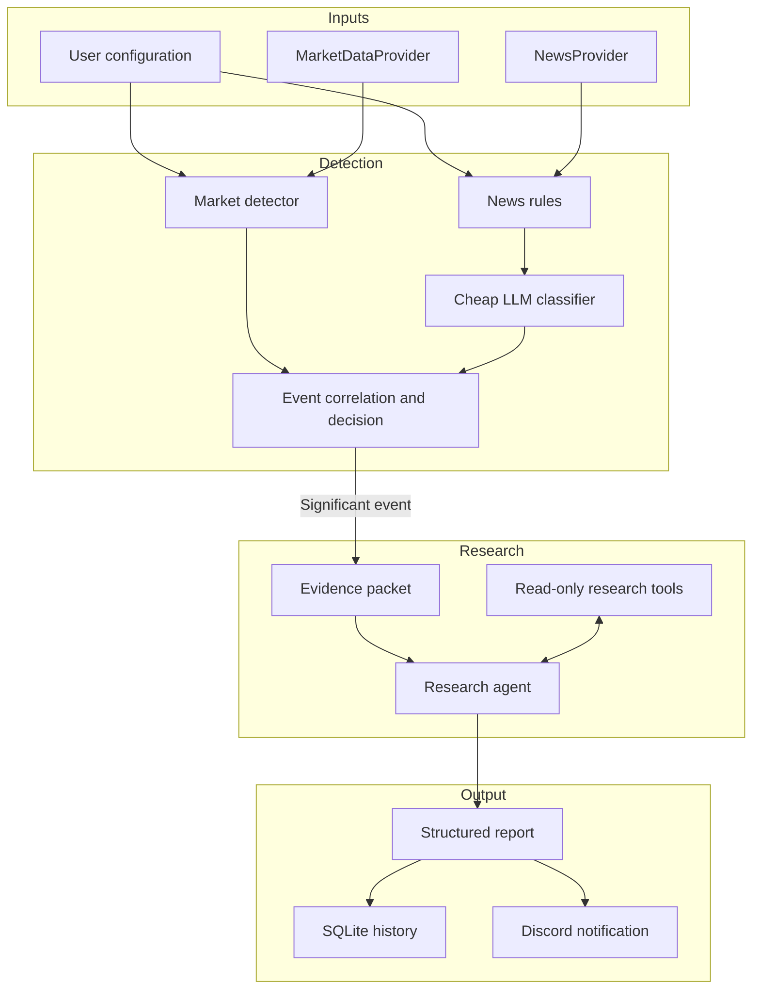
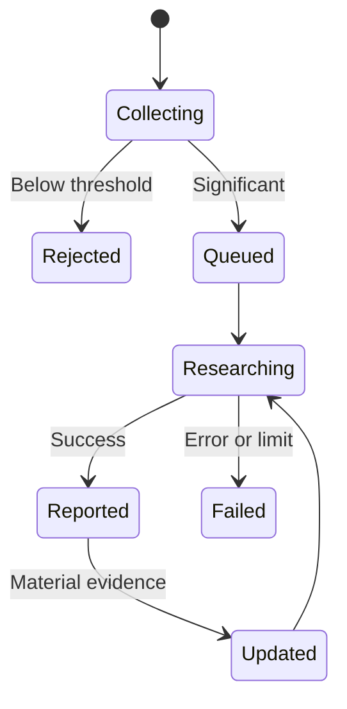

# AI Investment Assistant — MVP Source of Truth

**Status:** Approved high-level product, architecture, and development strategy  
**Last reviewed:** July 31, 2026  
**Primary goal:** Build a reliable personal market-monitoring and event-research assistant for a long-term investor.

**Document role:** This is the consolidated planning reference. It records the agreed product boundaries and enough architectural context to create the repository's smaller permanent documents. It is not meant to be loaded into every agent session after that split is complete.

---

## 1. Project Summary

The AI Investment Assistant is a personal tool that monitors a small watchlist of US stocks, detects potentially meaningful price, volume, or news events, investigates the most important events, and sends a structured report through Discord.

The application is designed for a **long-term investor interested in identifying and understanding potential buying opportunities**, not for day trading. It helps answer:

- What happened to this stock?
- What is most likely causing the movement?
- Is the event company-specific, industry-wide, or market-wide?
- Does the available evidence suggest temporary noise or a potentially fundamental development?
- What evidence supports that conclusion?
- What remains uncertain and deserves further review?

The application does **not** trade, predict the market with certainty, or make final investment decisions. The user remains responsible for every decision.

### Project constraints and intent

This is a solo side project owned by an entry-level engineer. It should be:

- Useful to its owner, not designed as a commercial product.
- Impressive and explainable in interviews.
- Modular enough to extend without pretending to be an enterprise platform.
- Small enough for one developer to build, test, operate, and understand.
- A practical demonstration of event-driven design, provider abstraction, deterministic logic, bounded AI use, persistence, reliability, and testing.

The project does not need every industry best practice. Architecture and process are valuable only when they improve the core loop, protect a meaningful boundary, reduce risk, or create a clear engineering lesson. Premature infrastructure and speculative abstractions should be rejected.

### The core MVP loop

> Detect a meaningful event → correlate related signals → assemble trustworthy evidence → produce one focused report → notify once.

This loop is the central proof of the project. Features that do not directly support it should generally be deferred.

---

## 2. Product Principles

### 2.1 Cheap detection, selective research

Continuous monitoring should use normal code and inexpensive classification. The more capable research model runs only when an event has already passed a significance threshold.

### 2.2 Deterministic logic before AI

Price movement, volume anomalies, watchlist membership, recency, cooldowns, and duplicate checks are handled with explicit rules. An LLM is used where semantic judgment is useful, not where ordinary code is more reliable.

### 2.3 Classification and research are separate jobs

The news classifier answers:

> Is this article relevant and significant enough to escalate?

The research agent answers:

> What happened, what evidence explains it, and what remains uncertain?

The classifier is intentionally small, cheap, structured, and narrow. It is not a miniature research agent.

### 2.4 The application owns data retrieval

The model does not automatically know the watchlist, live market data, SEC filings, or application history. The Python application retrieves and normalizes that data, constructs an evidence packet, and exposes narrowly scoped read-only tools to the research agent.

### 2.5 Provider independence

The detection engine must never depend directly on Alpaca SDK objects. It consumes the application's normalized internal models through a `MarketDataProvider` interface.

News uses a separate `NewsProvider` interface because market and news data may eventually come from different vendors.

This permits Alpaca Basic to be replaced later by Algo Trader Plus or another provider without rewriting the detection and research logic.

### 2.6 Evidence over authority

Reports should emphasize evidence, source quality, uncertainty, and competing explanations. They should use a **research posture**, not an authoritative buy or sell command.

### 2.7 Reliability before sophistication

Stream recovery, event deduplication, replay testing, cost limits, and visible health status are more important to the MVP than adding many indicators or a complicated agent framework.

### 2.8 Thin vertical slices over empty scaffolding

Development should prove the pipeline in small end-to-end slices. The first implementation is an offline walking skeleton that sends fixtures through the real internal boundaries while replacing external providers, models, and notifications with fakes.

Interfaces should be introduced at known replacement seams, especially market data, news, research, and notification delivery. Do not build a large hierarchy of empty services or finalize the entire package structure before working behavior exposes what the design actually needs.

---

## 3. High-Level Architecture



### 3.1 Runtime shape

The MVP is one local Python application with asynchronous workers, not a collection of microservices.

Conceptually, the runtime contains:

- Market-stream worker.
- News-stream worker.
- Detection and classification workers.
- Event-correlation service.
- Research worker.
- Notification worker.
- Controlled database-writing service or queue.
- Health and structured-logging support.

`asyncio` can coordinate these components inside one process. SQLite remains appropriate as long as database writes pass through a simple controlled boundary.

### 3.2 Major component boundaries

#### Provider layer

Connects to external data vendors and converts provider-specific responses into internal models.

```text
Alpaca SDK response
        ↓
AlpacaMarketDataProvider
        ↓
Normalized MarketBar / MarketSnapshot
        ↓
Detection engine
```

The initial implementations are:

- `AlpacaMarketDataProvider`
- `AlpacaNewsProvider`

The interfaces should be designed for replacement, not for multi-provider failover in the MVP.

#### Detection layer

Consumes normalized price, volume, benchmark, and news data. It applies deterministic rules and the cheap news classifier to create scored signals.

#### Event layer

Combines related signals into one `EventCandidate`, controls its lifecycle, and decides whether research is justified.

#### Research layer

Receives a prepared evidence packet and can request additional information through narrow read-only tools backed by Alpaca, SEC EDGAR, SQLite, and OpenAI web search.

#### Output layer

Validates the research result against a structured schema, persists it, and sends a concise Discord notification with source links.

---

## 4. MVP Feature Set

### 4.1 Watchlist and configuration

The user manually configures:

- Tickers to monitor.
- Whether a ticker is owned or merely watched.
- Optional cost basis or personal notes.
- Detection thresholds.
- Event correlation windows and cooldowns.
- Notification preferences.
- Regular-market-hours behavior.
- API cost and tool-call limits.

The MVP has no brokerage-account connection.

### 4.2 Market-data ingestion

The application streams normalized minute bars for watched stocks and a small number of comparison symbols.

It also retrieves historical bars for:

- Recent price context.
- Rolling price and volatility baselines.
- Same-feed volume baselines.
- Broad-market comparison, initially `SPY`.
- A relevant sector ETF when useful.
- Filling gaps after a live-stream interruption.

The MVP primarily uses minute bars. Processing every individual trade or quote is unnecessary.

Required reliability behavior:

- Automatic WebSocket reconnection.
- Last-received timestamps.
- Stale-stream detection.
- REST backfill for missing minute bars.
- Provider and feed identity stored with the data.
- Visible structured logs or a basic health/status command.

### 4.3 Deterministic market detection

Keep the initial rules understandable and testable:

- Price movement over one or two configured windows.
- Relative movement compared with `SPY`.
- Same-feed volume anomaly.
- Possibly simple recent volatility context.

Volume is supporting evidence, not a definitive trigger.

The first release should not require a large technical-analysis library, complicated indicator combinations, or predictive models.

### 4.4 News ingestion and filtering

The news pipeline receives company-related articles and applies deterministic filters before any model call:

- Is a watched ticker associated with the article?
- Is the article recent enough?
- Is the source acceptable?
- Does the headline or metadata match important event categories?
- Is the article an exact or likely duplicate?
- Has this ticker or topic exceeded its classifier-call limit?

Store both the provider article ID and normalized URL when available.

### 4.5 Cheap LLM news classification

Articles that pass deterministic filtering are sent to a small, inexpensive model.

The classifier returns a structured result such as:

- Ticker relevance.
- Event category.
- Potential market significance.
- Positive, negative, mixed, or neutral direction.
- Confidence.
- Short rationale.

If classification fails, the application should log and store the failure, then use a safe fallback rather than blocking the entire pipeline.

### 4.6 Event correlation and decision

Market signals and classified news do not immediately create separate research jobs. They are normalized into an `EventCandidate` and grouped when they appear related.

Initial rules:

- Correlate related signals over a short configurable window, initially around 15–30 minutes.
- Allow one active event per ticker/topic.
- Apply a cooldown after notification.
- Reopen or rerun research only when materially new evidence appears.
- Retain event status so crashes or retries do not create duplicate alerts.

This layer should support:

- Market movement with related news.
- Market movement without known news.
- Significant news before a price reaction.
- Market-wide or sector-wide movement.
- Several articles describing the same underlying event.

### 4.7 Focused research agent

The research agent runs only after an event passes the significance decision.

Its MVP questions are:

1. What happened?
2. What evidence most likely explains it?
3. Is the event company-specific, industry-wide, or market-wide?
4. Is there evidence of a potentially fundamental development?
5. What credible competing explanations exist?
6. What remains unknown?
7. What research posture is justified by the available evidence?

The agent does not perform comprehensive equity valuation, portfolio optimization, tax analysis, or personalized financial planning.

### 4.8 Structured report

The research response must conform to a Pydantic-backed schema containing:

- Ticker, company, and trigger time.
- Triggering market and/or news signals.
- Concise event summary.
- Likely cause and competing explanations.
- Price, volume, market, and sector context.
- Evidence list with source metadata.
- Potentially bullish considerations.
- Potentially bearish considerations.
- Temporary/noise versus potentially fundamental assessment.
- Confidence level.
- Research posture.
- Important uncertainties and missing information.
- Report-generation and retrieval timestamps.

Suggested research postures:

- `MONITOR`
- `INVESTIGATE_FURTHER`
- `POTENTIAL_OPPORTUNITY_TO_REVIEW`
- `WAIT_FOR_CLARITY`

These are not trade instructions.

### 4.9 Persistence

SQLite stores:

- Watchlist entries and thresholds.
- Provider and feed metadata.
- Recent bars required by rolling calculations.
- Market signals.
- News articles and classification results.
- Event candidates and lifecycle state.
- Prior reports.
- Notification status and retry history.
- Source URLs and retrieval timestamps.
- Deduplication identifiers.
- Research and classification failures.

Asynchronous workers should not all write to SQLite independently. Use one controlled database-writing service or queue inside the process.

### 4.10 Discord notifications

The final Discord alert should provide:

- Ticker and event summary.
- The main detected movement or news trigger.
- Likely explanation.
- Confidence and research posture.
- Key uncertainty.
- Links to the most important sources.
- A reference to the saved full report when appropriate.

The system must prevent duplicate sends and should record notification success or failure.

### 4.11 Replay mode and operational visibility

Replay mode is part of the MVP because real market events are unpredictable and difficult to use for development.

Recorded market and news fixtures should pass through the same detection, event, and research boundaries used by the live system.

Minimum scenarios:

- Large price drop without news.
- Major news without a large price movement.
- Duplicate and updated news stories.
- Broad market selloff.
- Stream disconnection and missing bars.
- Repeated triggers from the same event.
- Research or notification failure.

Operational visibility should include:

- Structured logs.
- Stream connection state.
- Last market and news timestamps.
- Queue or worker health.
- Recent failure summaries.
- Current API-cost or call-count totals.

---

## 5. Inputs and Data Sources

### 5.1 Data-source proposal

| Need | MVP source | How the application accesses it | Main use |
|---|---|---|---|
| User preferences | Local configuration / SQLite | Application-controlled reads | Watchlist, thresholds, cooldowns, preferences |
| Live prices and volume | Alpaca | `alpaca-py` WebSocket stream | Market monitoring |
| Historical bars and snapshots | Alpaca | `alpaca-py` REST client | Baselines, comparisons, gap recovery |
| Company-specific news | Alpaca | News WebSocket and REST client | News detection and evidence |
| Filing metadata and documents | SEC EDGAR | Direct HTTPS requests through a small application client | Official company disclosures |
| Structured filing facts | SEC EDGAR Company Facts | Direct JSON API, used selectively | Supporting fundamental context |
| Broader current research | OpenAI hosted web search | Responses API tool | Current public evidence beyond Alpaca and EDGAR |
| Application-specific history | SQLite | Narrow repository functions | Prior events, reports, and duplicate prevention |

### 5.2 Alpaca market data

The initial provider is Alpaca Basic.

Current planning assumptions:

- Free access to US stocks and ETFs.
- Real-time equities data from IEX, not the consolidated US market.
- Up to 30 WebSocket symbol subscriptions.
- Historical equity data since 2016.
- The latest 15 minutes of historical data are restricted on Basic.
- Up to 200 historical API calls per minute.

These limits are provider terms and must be rechecked during implementation. See [Alpaca's market-data plan comparison](https://docs.alpaca.markets/us/docs/about-market-data-api).

#### Important IEX limitation

IEX volume is only part of total US trading volume. Therefore:

- Build current and historical volume baselines from the same IEX feed.
- Describe the metric as an **IEX volume anomaly**, not total-market volume.
- Treat it as supporting context rather than proof of significance.
- Persist the provider and feed name with every bar and derived signal.

The limitation is acceptable for a personal MVP, provided the application is honest about what the data represents.

#### Access

- Create an Alpaca account.
- Generate an API key and secret.
- Store credentials in environment variables, never in the repository or model prompt.
- Use the official `alpaca-py` package.
- Use live WebSockets for minute bars and REST for historical retrieval and backfill.

Alpaca documents both [real-time WebSocket stock data](https://docs.alpaca.markets/us/docs/real-time-stock-pricing-data) and an [official market-data getting-started flow](https://docs.alpaca.markets/us/docs/getting-started-with-alpaca-market-data).

### 5.3 Alpaca news

News inputs may include:

- Article ID.
- Headline.
- Summary.
- Article content when available.
- Publisher/source.
- Author.
- Associated tickers.
- Publication and update timestamps.
- Original URL.

The application initially uses Alpaca's news WebSocket and REST endpoints through the same credentials and Python SDK. See [Alpaca's real-time news documentation](https://docs.alpaca.markets/us/docs/streaming-real-time-news).

News entitlement and delivery timeliness should be tested during setup because provider pricing pages describe equity entitlements more explicitly than news entitlements. If Basic news is delayed, the architecture remains valid; only alert timeliness changes.

### 5.4 SEC EDGAR

EDGAR is the authoritative source for company filings.

The application uses:

- SEC ticker-to-CIK mapping.
- Submissions API for recent 8-K, 10-Q, 10-K, Form 4, and other relevant filing metadata.
- EDGAR archive documents for selected primary filings or exhibits.
- Company Facts JSON selectively when structured reported facts are useful.

The MVP should query EDGAR **on demand during research**, not continuously monitor every filing.

#### Access rules

- Build a small `SecEdgarClient`, likely using `httpx`.
- Send a declared application user agent with contact information.
- Cache ticker mappings, filing metadata, company facts, and immutable filings.
- Remain well below the SEC's maximum of 10 requests per second.
- Retry politely after throttling or server errors.
- Prefer published JSON APIs over scraping search-result pages.

See the SEC's [EDGAR API documentation](https://www.sec.gov/search-filings/edgar-application-programming-interfaces) and [fair-access guidance](https://www.sec.gov/about/developer-resources).

#### MVP limitation

Reliable interpretation of arbitrary filing HTML, exhibits, and XBRL can become a separate project. The first version should:

- Find recent relevant filings.
- Download the primary document only when useful.
- Extract a limited amount of readable text.
- Include a direct filing link.
- Use Company Facts as optional supporting context.

Perfect filing extraction and comprehensive XBRL normalization are deferred.

### 5.5 OpenAI web search

Hosted web search supplements the structured providers with:

- Company investor-relations material.
- Government and regulator announcements.
- Earnings releases.
- Industry or competitor events.
- Litigation or regulatory developments.
- Macroeconomic explanations.
- Credible financial reporting.

The application enables web search through the OpenAI Responses API. The model may request searches within the configured limits. See the [OpenAI web-search guide](https://developers.openai.com/api/docs/guides/tools-web-search).

Source priority:

1. SEC filings.
2. Company investor-relations material.
3. Government or regulator sources.
4. Alpaca-provided financial news.
5. Major credible financial reporting.
6. Other sources only when clearly identified.

Web search supplements Alpaca and EDGAR; it does not replace them.

### 5.6 SQLite as a research input

Application history helps answer:

- Has this event already produced an alert?
- Has the ticker triggered repeatedly today?
- Did a prior report analyze the same cause?
- Is the newest evidence materially different?
- What context was available during the earlier event?

The research model does not receive unrestricted SQL. The application exposes narrow read-only functions such as `get_prior_reports(ticker, days)`.

---

## 6. Core Internal Data Types

Exact fields may evolve during development, but these conceptual contracts should remain stable.

### `MarketBar`

- Symbol.
- Start/end timestamp.
- Open, high, low, close.
- Volume.
- Provider.
- Feed.
- Resolution.
- Completeness/backfill status.

### `MarketSignal`

- Symbol and trigger timestamp.
- Signal type.
- Measurement window.
- Observed value and baseline.
- Market/sector-relative context.
- Significance score.
- Provider/feed provenance.

### `NewsArticle`

- Provider article ID.
- Normalized URL.
- Headline and summary.
- Content when available.
- Source and author.
- Related tickers.
- Published and updated timestamps.
- Normalized headline fingerprint.

### `NewsClassification`

- Article reference.
- Ticker relevance.
- Event category.
- Direction.
- Significance score.
- Confidence.
- Short rationale.
- Model and prompt version.

### `EventCandidate`

- Stable event ID.
- Ticker and topic/category.
- Trigger and update timestamps.
- Related market signals.
- Related news classifications.
- Combined significance score.
- Deduplication key.
- Lifecycle status.
- Cooldown and re-research state.

Suggested lifecycle:



### `ResearchEvent`

The initial evidence packet supplied to the agent:

- Ticker and company.
- Trigger timestamp.
- Triggering rules and scores.
- Price, volume, volatility, market, and sector context.
- Related classified news.
- Known recent filing matches.
- Prior related alerts or reports.
- Specific research questions.

### `ResearchReport`

- Trigger summary.
- Likely cause.
- Competing explanations.
- Market context.
- Evidence and citations.
- Bullish and bearish considerations.
- Temporary versus potentially fundamental assessment.
- Confidence.
- Research posture.
- Uncertainties.
- Generation metadata.

---

## 7. Research-Agent Access and Controls

### 7.1 Tools available to the agent

| Tool | Backing source | Purpose |
|---|---|---|
| `get_market_context` | `MarketDataProvider` | Recent price, volume, benchmark, and historical context |
| `get_related_news` | `NewsProvider` | Recent ticker-related articles |
| `get_recent_filings` | SEC submissions API | Identify relevant recent filings |
| `get_filing_content` | SEC archive | Retrieve limited text from one selected filing |
| `get_company_facts` | SEC Company Facts | Retrieve selected structured financial facts |
| `get_prior_reports` | SQLite | Read prior application analysis |
| `web_search` | OpenAI hosted tool | Find broader current public evidence |

Application-backed tools use OpenAI function calling: the model requests a tool with structured arguments, the Python application executes the external query, and the result is returned to the model. The model never receives provider credentials. See the [OpenAI function-calling guide](https://developers.openai.com/api/docs/guides/function-calling).

### 7.2 Access the agent must not receive

- Alpaca or OpenAI API secrets.
- Brokerage or order-execution access.
- Unrestricted database access.
- Shell access.
- General filesystem access.
- Arbitrary network requests outside approved research tools.
- The ability to modify the watchlist, thresholds, reports, or event state directly.

### 7.3 Structured outputs

Classifier and research outputs should be constrained to JSON schemas and validated through Pydantic before persistence or notification. See the [OpenAI Structured Outputs guide](https://developers.openai.com/api/docs/guides/structured-outputs).

Invalid, incomplete, or timed-out model responses must be treated as ordinary failure states, not silently trusted.

---

## 8. Important Processing Rules

### Market rules

- Start with regular US market hours only.
- Use minute bars rather than every trade.
- Compare volume with a baseline from the same provider/feed.
- Use `SPY` as an initial broad-market comparison.
- Keep signal rules explicit, configurable, and replayable.

### News rules

- Deterministic filtering occurs before LLM classification.
- Article ID alone is not sufficient for duplicate control.
- Initial clustering uses ticker, normalized headline, URL/ID, publication window, and event category.
- Perfect semantic clustering is not required.

### Event rules

- Market and news signals can arrive in either order.
- Related signals should enrich one event rather than create repeated jobs.
- Only one active event per ticker/topic.
- Notification cooldowns are mandatory.
- New research requires materially new evidence, not a routine price update.

### Research rules

- Research begins only after event significance is established.
- Every important factual claim should be traceable to a source.
- Prefer primary sources.
- Cap the number and size of articles, filing excerpts, tool calls, and searches.
- Store failures and partial evidence.
- If research fails, the event remains recorded; optionally send a short notification that research was unavailable.

### Notification rules

- Persist notification state.
- Retry safely.
- Never send the same completed report twice.
- Prefer one useful alert over several incremental alerts.

---

## 9. Cost, Rate, and Failure Controls

The application needs hard limits from the beginning:

- Maximum classifier calls per ticker per hour.
- Maximum research runs per event.
- Maximum web searches per research run.
- Maximum related articles supplied to the model.
- Maximum filing-text size.
- Maximum tool-call rounds.
- Research timeout.
- Daily OpenAI cost ceiling.
- Provider-specific rate limiting.

Expected failures:

- WebSocket disconnection.
- Missing or late market bars.
- Delayed news.
- Provider rate limiting.
- Duplicate articles.
- Misclassified news.
- No obvious explanation for a price move.
- EDGAR document parsing failure.
- Research timeout or invalid schema.
- Discord delivery failure.
- Process restart during event handling.

Each failure should produce an explicit state, structured log entry, and safe retry or graceful fallback. No component should silently stop monitoring.

---

## 10. Known Limitations

- Alpaca Basic uses IEX rather than consolidated US market data.
- IEX volume is not total-market volume.
- The free watchlist is constrained by Alpaca's 30-symbol WebSocket limit, including benchmark ETFs.
- News access or timeliness may depend on account entitlement and must be tested.
- Correlation rules will not perfectly determine whether signals share one cause.
- News classification can be wrong.
- Web search quality depends on available sources and can surface conflicting reports.
- SEC filings may be long, irregular, or difficult to extract.
- A price move can remain unexplained even after research.
- The report lacks the complete information required for personalized investment advice, including full portfolio concentration, taxes, valuation model, time horizon, liquidity needs, and a maintained investment thesis.
- Local runtime means monitoring stops when the application or computer is offline.
- SQLite and a single-process runtime are intentionally chosen for MVP simplicity, not unlimited scale.

These are accepted MVP tradeoffs, not reasons to add premature complexity.

---

## 11. Technology Stack

- **Language:** Python.
- **Concurrency:** `asyncio`.
- **Market and news provider:** Alpaca through `alpaca-py`.
- **Research and classification:** OpenAI Responses API.
- **Regulatory data:** SEC EDGAR through direct HTTPS requests, likely with `httpx`.
- **Validation and schemas:** Pydantic.
- **Persistence:** SQLite with SQLAlchemy.
- **Data calculations:** Python standard library plus NumPy/pandas where they materially simplify rolling analysis.
- **Notifications:** Discord.
- **Packaging/runtime:** Docker, while preserving a straightforward local development flow.
- **Testing:** Unit tests, provider contract tests, integration tests with mocked external calls, and replay fixtures.

The MVP does not require LangChain, CrewAI, Redis, Celery, Kafka, PostgreSQL, Kubernetes, or microservices.

---

## 12. Repository Documentation and Development Process

### 12.1 Permanent document map

The repository should not use one enormous document as the context for every human or agent task. Stable information should be divided by responsibility:

| File | Owns | Does not own |
|---|---|---|
| `README.md` | Short project orientation, core flow, setup/run commands, and links to deeper docs | Full architecture, decision history, or feature plans |
| `AGENTS.md` | Instructions for coding agents: required reading, workflow, boundaries, validation commands, and change rules | Product narrative or detailed feature design |
| `docs/PRODUCT.md` | Problem, user, goals, MVP scope, non-goals, product principles, and success criteria | Internal code structure |
| `docs/ARCHITECTURE.md` | Stable system boundaries, data flow, domain concepts, integrations, reliability model, and security boundaries | Exact classes, schemas, or task checklists |
| `docs/DECISIONS.md` | Durable accepted, proposed, superseded, or rejected product and technical decisions with rationale | Routine implementation choices already clear in code |
| `docs/ROADMAP.md` | Ordered milestones, outcomes, status, and milestone-level acceptance | Detailed implementation tasks |
| `specs/<number>-<feature>/` | Approved feature-specific scope, plan, tasks, and acceptance criteria | Permanent project-wide truth |

Do not create a separate `RULES.md`. Repository and agent working rules belong in `AGENTS.md`; duplicating them creates drift.

This consolidated document is the migration input for those files. After the split, each fact should have one authoritative home and other documents should link to it rather than repeat it.

### 12.2 Feature-spec structure

Keep a reusable template at:

```text
specs/_template/
├── SPEC.md
├── PLAN.md
└── TASKS.md
```

Each meaningful milestone or feature receives a numbered folder using the same three-file structure:

- `SPEC.md`: what is being built, why it matters, scope, non-goals, behavior, and acceptance criteria.
- `PLAN.md`: the implementation approach, affected boundaries, risks, and validation strategy.
- `TASKS.md`: small ordered tasks and current execution status.

Only the active feature spec needs to be loaded alongside the relevant permanent documents. When implementation reveals a durable change, update `docs/DECISIONS.md`, `docs/ARCHITECTURE.md`, or `docs/PRODUCT.md` instead of letting completed feature specs silently redefine the project.

### 12.3 Stable decisions versus flexible details

Treat these as stable unless deliberately revised:

- Long-term-investor research assistant, not an automated trader.
- One modular local Python application for the MVP.
- Provider-independent normalized models and narrow external-service interfaces.
- Deterministic detection before AI escalation.
- Cheap news classification separate from deeper research.
- Bounded read-only research tools and structured outputs.
- SQLite, Discord, replay fixtures, deduplication, reliability, and cost controls.

Keep these flexible until implementation provides evidence:

- Exact package and class structure.
- Complete database schema and repository method names.
- Detection thresholds and scoring formulas.
- Number and arrangement of asynchronous workers.
- Exact model choices, prompts, and report wording.
- Optional libraries that are not required by an active feature.

### 12.4 Working rules

- Build and validate one milestone before expanding the next.
- Prefer a thin end-to-end behavior over broad unused scaffolding.
- Add an abstraction only for a real boundary or demonstrated variation.
- Keep commits and agent tasks narrow enough to review and test.
- Update the active spec when scope or implementation understanding changes.
- Run the repository's documented format, lint, type-check, and test commands before declaring a task complete.
- Never expose credentials or include them in model prompts, fixtures, logs, or the repository.

---

## 13. Explicitly Deferred

- Automatic trading or order execution.
- Brokerage-account integration.
- Autonomous buy/sell decisions.
- Portfolio rebalancing.
- Portfolio-aware or tax-aware recommendations.
- Full valuation models.
- Continuous financial planning.
- Full SEC/XBRL normalization.
- Perfect filing interpretation.
- Sophisticated semantic news clustering.
- Complicated technical-analysis strategies.
- Predictive price models.
- Multi-provider failover.
- Web or mobile frontend.
- Distributed workers.
- Production cloud deployment.
- Redis, Celery, Kafka, or a microservice architecture.
- Complex multi-agent frameworks.

The provider interfaces should make future upgrades possible, but the MVP should implement only the Alpaca-backed providers.

---

## 14. MVP Success Criteria

The MVP is successful when it can reliably demonstrate that:

1. A small configured watchlist can be monitored during regular market hours.
2. Live-stream interruptions are detected and missing minute bars can be recovered.
3. Simple deterministic rules produce understandable market signals.
4. News is filtered and classified without researching every article.
5. Related market and news signals become one deduplicated event.
6. A significant event produces a bounded research run using controlled data tools.
7. The resulting report conforms to the expected schema and cites its evidence.
8. Discord receives one useful alert rather than repeated notifications.
9. Event, report, failure, and notification history survive process restarts.
10. Recorded scenarios can replay through the same core pipeline used by live events.
11. External provider details remain isolated behind interfaces and normalized models.
12. API usage remains within configured rate and cost limits.

---

## 15. Development Strategy and Order

This document defines product and architecture boundaries, not a rigid class-by-class implementation sequence. Development should move through proven vertical capabilities.

### Milestone 0 — Repository foundation

Create only the minimum development foundation:

- Python project and package skeleton.
- Configuration contract and environment-variable handling.
- Structured-logging foundation.
- Test layout and lightweight quality checks.
- Exact setup, run, format, lint, type-check, and test commands.
- CI for those checks if it remains simple.
- Permanent documentation and feature-spec templates from Section 12.

Do not pre-create a large package tree, empty service classes, or speculative abstractions.

### Milestone 1 — Offline walking skeleton

The first development feature should be `specs/001-offline-walking-skeleton/`. It proves:

> fixture data → normalization → deterministic detection → signal correlation → event creation → fake research report → console notification

In scope:

- Local JSON market and news fixtures.
- Minimal normalized representations of `MarketBar`, `NewsArticle`, `Signal`, `Event`, and `ResearchReport`.
- Narrow `MarketDataProvider` and `NewsProvider` contracts with fake implementations.
- A controllable clock where time affects behavior.
- One simple market rule and one simple deterministic news filter.
- Basic correlation into one event.
- A fake research component that returns a schema-valid placeholder report.
- A console notifier.
- One command that runs the complete offline flow.
- End-to-end tests for at least one triggering and one non-triggering scenario.

Out of scope for this milestone:

- Alpaca, live streams, real news APIs, SEC EDGAR, web search, or API keys.
- LLM classification or a real research agent.
- SQLite durability, Discord, scheduling, cloud deployment, or production operations.
- Comprehensive detection rules, final scoring formulas, or a large dependency-injection framework.

Acceptance requires the pipeline to run deterministically without internet access or secrets, produce exactly one report and notification for the triggering fixture, produce none for the non-triggering fixture, and pass the repository checks.

This is not a throwaway prototype. It is the real core flow with external adapters replaced by fakes, allowing later integrations to be added without discovering the architecture for the first time against live systems.

### Later milestones

2. **Durable event foundation:** add SQLite persistence, event lifecycle, deduplication, cooldowns, notification state, and restart-safe behavior.
3. **Live market data:** implement the Alpaca market provider, historical baselines, stream health, reconnection, stale detection, and REST backfill.
4. **News and classification:** implement live news ingestion, duplicate filtering, call limits, and the cheap structured LLM classifier.
5. **Research and reporting:** build the evidence packet, bounded read-only Alpaca/EDGAR/history/web tools, research agent, citations, and validated report.
6. **Discord and operations:** add Discord delivery, safe retries, health/status visibility, and rate/cost enforcement.
7. **Full-loop hardening:** replay representative failures and market scenarios through the same boundaries used in live operation, then tune rules based on observed behavior.

Low-level classes, table designs, thresholds, scoring formulas, and package structure may change as development reveals better choices. The approved boundaries and product principles above should remain stable unless deliberately revised.

---

## 16. Final Definition

**The AI Investment Assistant MVP is a local, single-process Python application that monitors a small stock watchlist through replaceable market and news provider interfaces, uses deterministic rules and a cheap LLM classifier to identify significant events, correlates related signals into one durable event, launches bounded evidence-based research only when justified, and sends one structured Discord report while leaving all investment decisions and trading actions to the user.**
